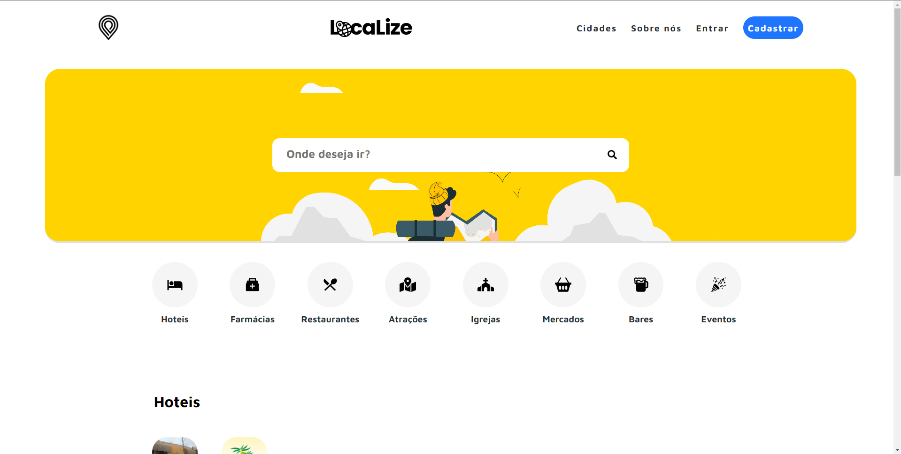

# Projeto de turismo em ReactJS :triangular_flag_on_post:

Esse foi meu primeiro projeto desenvolvido em ReactJS para o primeiro hackaton que participei.

## <a href="https://hackaton-turismo.vercel.app/"> Clique aqui para visitar o site <a/>

A proposta da maratona foi desenvolver uma plataforma front-end para o turismo da cidade de Bandeirantes-PR, com uma API já estabelecida.

A plataforma Web totalmente responsiva, é separada por sessões e apresenta uma barra de pesquisa.
Ela apresenta os pontos que são de interesse do turista, como, hotéis, bares, atração, entre outros. E uma página de detalhes de cada um deles, com informações específicas.

 

## Tecnologias usadas :hammer:

O software foi desenvolvido em:

<ul>
  <li> HTML </li>
  <li> CSS </li>
  <li> JavaScript </li>
</ul>

e usada bibliotecas como:

<ul>
  <li> ReactJS </li>
  <li> Styled Components </li>
  <li> Swiper </li>
  <li> React Icons </li>
</ul>
